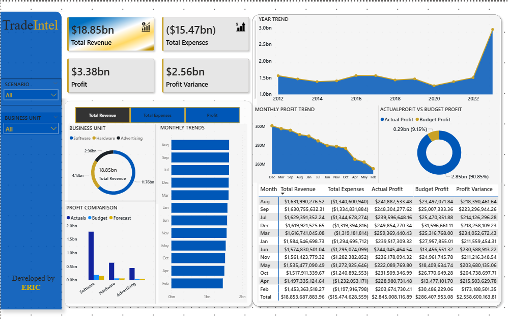

# Financial_Performance_Powerbi_Dashboard
A Power BI dashboard project for analyzing company financials, focusing on profit trends, business unit comparison, and budget vs actual performance using DAX and interactive visuals.
This project analyzes company financial data using Power BI. It focuses on **profit trends**, **business unit performance**, and **budget vs actual** comparisons. The dashboard provides interactive visuals and KPIs to support high-level financial decision-making.

---

## 📁 Dataset

- **Source:** Excel file (`Financials Sample Data.xlsx`)
- **Contents:** Monthly revenue and expense data by business unit, account type, scenario (Actual, Budget, Forecast), and year
- **Format:** Unpivoted structure with a date column generated for time-based analysis

---

## 🧮 Key Metrics (DAX Measures)

- `Total Revenue`
- `Total Expenses`
- `Profit`
- `Profit Variance`
- `Actual Profit`, `Budget Profit`

---

## 📊 Visualizations

- **KPI Cards** – Revenue, Expenses, Profit, Profit Variance
- **Line Chart** – Yearly profit trends
- **Bar Chart** – Profit by business unit
- **Clustered Chart** – Actual vs Budget Profit
- **Donut Chart** – Revenue share by unit
- **Table** – Monthly profit details

---

## 🔍 Interactive Features

- **Slicers** for Scenario, Business Unit, and Month
- Drill-down by year and month
- Filters for custom views

---

## 🛠 Tools & Techniques

- Power BI Desktop
- Power Query (unpivoting, data transformation)
- DAX for measure creation
- Custom sorting for months
- Clean layout with consistent color-coding for scenarios

---

## 📂 Files in This Repo

| File | Description |
|------|-------------|
| `Financials Sample Data.xlsx` | Secondary data used |
| `Financial_Performance_Dashboard.pbix` | Power BI report file |
| `README.md` | This documentation |

---

## 📌 How to Use

1. Download or clone the repo
2. Open the `.pbix` file in Power BI Desktop
3. Review or customize DAX measures
4. Filter by scenario, unit, or month to explore insights

---

## Dashboard Preview

###  Financial Performance Overview

---

## 📬 Contact

Developed by **Eric Abakah**
GitHub: [@eabakah10](https://github.com/eabakah10)  
LinkedIn: [linkedin.com/in/eric-abakah](https://www.linkedin.com/in/eric-abakah-11a6361a7)  
Email: ehricabakah98@gmail.com

Please feel free to reach out for feedback or collaboration.
